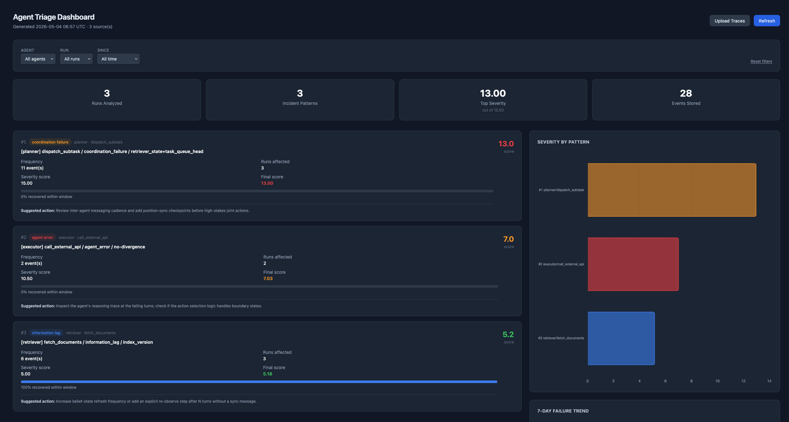

# agent-triage

> **Rank multi-agent failures by what actually matters — not by what showed up first in the log.**

[](https://github.com/thebharathkumar/agent-triage/actions/workflows/ci.yml)
[](https://pypi.org/project/agent-triage/)
[](https://www.python.org/downloads/)
[](https://opensource.org/licenses/MIT)
[](#development)
[](https://mypy-lang.org/)

`agent-triage` ingests trace files from multi-agent systems (NDJSON or OpenTelemetry) and produces a ranked "what actually needs your attention this morning" severity report. It ships a CLI, a web dashboard, an OTLP receiver, and optional LLM-generated root-cause narratives.

<!-- Replace this with a real screenshot once you've taken one: -->
<!--  -->

---

## Why this exists

When multi-agent systems run at scale, they generate thousands of trace events per day. Most observability tools dump everything into a dashboard and leave triage to the human. That is the wrong default.

The signal you actually need at 9 AM is not "here are 847 events from last night." It's: **"here are the three failure patterns that matter, ranked by how bad they are and whether the agents recovered."**

`agent-triage` is that tool. It clusters events into incident patterns, scores each pattern across three dimensions (frequency, severity, recovery), and surfaces a short ranked list with plain-English explanations and a suggested next action.

---

## Features

- **CLI** — pipe NDJSON traces in, get a markdown morning report out
- **Web dashboard** — interactive UI with charts, severity heatmap, and drill-down
- **OTLP receiver** — accept OpenTelemetry spans directly from production agents
- **LLM root-cause analysis** — optional Claude-generated narratives (Haiku 4.5 with prompt caching)
- **Docker-ready** — `docker compose up` and you have a dashboard
- **PyPI-published** — `pip install agent-triage`
- **Production quality** — 100+ tests, 92%+ coverage, mypy strict, ruff clean

---

## Quick start

### Option 1: Docker (recommended for trying it out)

```bash
git clone https://github.com/thebharathkumar/agent-triage.git
cd agent-triage
docker compose up
```

Then open <http://localhost:8000> and upload a trace file.

### Option 2: pip

```bash
pip install "agent-triage[server,ai]"

# CLI
triage runs/phase4/events_seed42.ndjson

# Web dashboard
triage-serve
```

### Option 3: Stream OTLP from a running agent

```bash
# Start the receiver
triage-serve

# In another shell, send some demo spans
python examples/emit_otlp.py
```

The dashboard at <http://localhost:8000> will populate in real time.

---

## Three ways to use it

### 1. CLI — drop a trace file in, get a markdown report

```bash
triage runs/phase4/*.ndjson --top 5
```

Add `--ai-analysis` to enrich the top incidents with Claude-generated root-cause narratives:

```bash
export ANTHROPIC_API_KEY=sk-ant-...
triage runs/phase4/*.ndjson --ai-analysis
```

See [`examples/seed42-report.md`](examples/seed42-report.md) for a real generated report.

### 2. Dashboard — for interactive exploration

```bash
triage-serve --host 0.0.0.0 --port 8000
```

The dashboard supports drag-and-drop NDJSON upload, live severity charts, and per-incident AI narratives.

### 3. OTLP receiver — for production agents

Configure your agent to send spans to `http://your-host:8000/otlp/v1/traces` using the standard OTLP/HTTP JSON format. Map these span attributes:

| Attribute | Type | Description |
|-----------|------|-------------|
| `agent.id` | string | Which agent acted |
| `run.id` | string | Which run this event belongs to |
| `turn` | int | Turn number within the run |
| `action.tool` | string | Tool/action name |
| `action.succeeded` | bool | Whether the action succeeded |
| `failure.classification` | string | One of: `coordination_failure`, `agent_error`, `information_lag`, `environment_constraint` |
| `divergence.fields` | string | Comma-separated belief-divergence fields |

See [`examples/emit_otlp.py`](examples/emit_otlp.py) for a working end-to-end example.

---

## Architecture

```
                                  ┌─────────────────┐
   NDJSON file ─────────┐         │                 │
                        ├──►──────┤                 │
   OTLP/HTTP spans ─────┘         │   Loader        │
                                  │   ↓             │
                                  │   Grouper       │
                                  │   ↓             │
                                  │   Scorer        │──►── Markdown report (CLI)
                                  │   ↓             │
                                  │   Reporter      │──►── JSON API (dashboard)
                                  │                 │
                                  └─────────────────┘
                                          │
                                          ↓ (optional)
                                  ┌─────────────────┐
                                  │  Claude Haiku   │
                                  │  (cached)       │──►── Root-cause narrative
                                  └─────────────────┘
```

| Module | Responsibility |
|--------|---------------|
| `loader.py` | Parse NDJSON / OTLP into validated `TraceEvent` objects |
| `grouper.py` | Cluster events into `IncidentPattern` buckets by signature |
| `scorer.py` | Score patterns by frequency, severity, and recovery rate |
| `reporter.py` | Render the morning markdown report |
| `analyst.py` | Optional Claude-generated root-cause narratives |
| `server.py` | FastAPI app — dashboard + OTLP receiver |
| `cli.py` | Click-based command-line entry point |

---

## Scoring model

Each incident pattern is scored across three dimensions, then combined.

**Frequency (40% weight)** — how many times the pattern appeared, normalized 0–10 against the most frequent pattern in the batch.

**Severity (60% weight)** — weighted by failure classification:

| Classification | Weight |
|----------------|--------|
| `coordination_failure` | 1.0 |
| `agent_error` | 0.7 |
| `information_lag` | 0.5 |
| `environment_constraint` | 0.2 |

**Recovery** — did the agent succeed within 3 turns after the failure? If zero occurrences recovered, severity is multiplied by 1.5. This captures the difference between a transient hiccup and a pattern that gets agents stuck.

```
final_score = (frequency_score * 0.4) + (severity_score * 0.6)
```

---

## Design decisions

### Why severity scoring instead of anomaly detection?
Anomaly detection tells you what is unusual. Severity scoring tells you what matters. A `coordination_failure` that happens on every run is not an anomaly — it's a chronic problem. Scoring surfaces chronic problems alongside rare-but-catastrophic ones using weights that reflect operational cost.

### Why prompt caching for the LLM?
Each pattern triggers one Claude call, but the system prompt is identical across calls. With Anthropic's `cache_control: ephemeral`, the system prompt is cached server-side after the first call and reused on subsequent ones, cutting per-call cost ~90% for batches of 3+ patterns.

### Why an embedded HTML dashboard instead of React/Next.js?
A pitch tool should run in 30 seconds, not 30 minutes. The dashboard ships as a single HTML string with Tailwind + Chart.js via CDN — no build step, no `node_modules`, no `npm install`. Everything is in `src/triage/server.py`. Upgrading to a separate frontend later is straightforward; the backend already returns clean JSON.

### Why three top incidents?
Three is the number of things a person can hold in working memory while still being able to act on them. A list of 10 is noise. A list of 1 is overconfident. Three forces the model to prioritize, which is the core value proposition.

---

## Development

```bash
git clone https://github.com/thebharathkumar/agent-triage.git
cd agent-triage
python -m venv .venv && source .venv/bin/activate
pip install -e ".[dev]"

pytest --cov=triage --cov-report=term-missing   # tests
ruff check src/triage tests                     # lint
mypy src/triage                                 # type check
```

Quality gates enforced in CI:

- 100+ tests, 92%+ coverage
- `ruff check` clean
- `mypy --strict` clean

See [`CONTRIBUTING.md`](CONTRIBUTING.md) for PR guidelines.

---

## Schema source

The original NDJSON trace format is compatible with [dungeon-traces](https://github.com/thebharathkumar/dungeon-traces), a multi-agent simulation that produces event logs for dungeon-navigation runs.

---

## License

MIT — see [LICENSE](LICENSE) for details.
